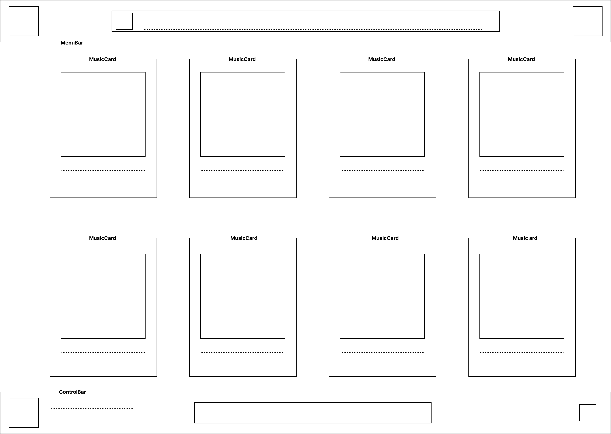
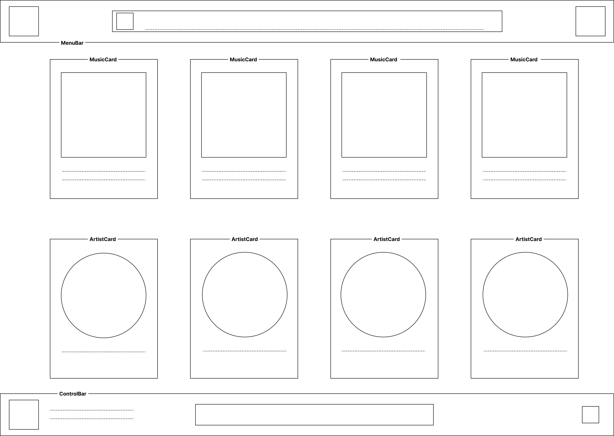
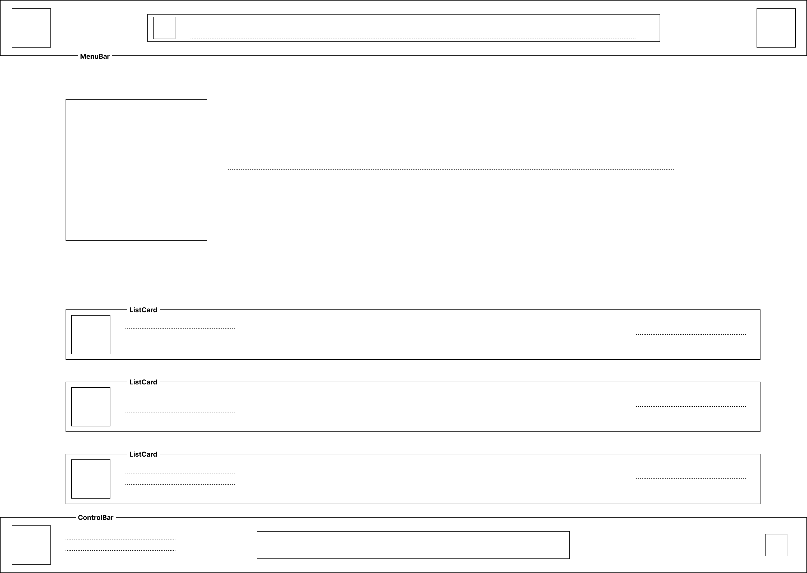
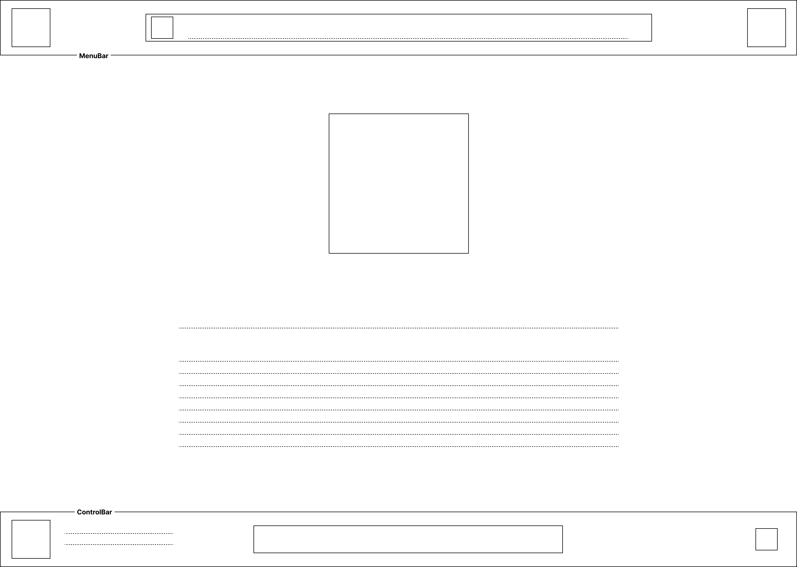

# GreenWave

Un service pour rendre le streaming musicale écoresponsable.

## Choix du sujet

Notre binôme cumule a lui seul 15 heures d'écoute hebdomadaire. Conscient de l'impact écologique du streaming de manière générale, nous nous sentons concernés et souhaitons réduire cet impact.  
Qui plus est, en 2024 46% des français (31,1 millions, source : [Médiamétrie](https://www.mediametrie.fr/fr/musique-et-medias-un-engouement-tres-fort-du-public-pour-une-offre-multiple)) écoutent de la musique via une plateforme de streaming au cours du mois. Ce qui prouve le fort interêt qu'a la population dans ce service, cette dernière a d'ailleurs fait augmenter cette pratique de 30% au cours des 5 dernières années (source [Médiamétrie](https://www.mediametrie.fr/fr/musique-et-medias-un-engouement-tres-fort-du-public-pour-une-offre-multiple))

## Utilité sociale

La musique est un bien culturel essentiel et son accessibilité élargie constitue un bénéfice considérable. Le streaming permet d’y accéder à moindre coût tout en donnant à chacun la possibilité de découvrir une immense diversité musicale. Au-delà de cet accès, la musique agit directement sur la santé et le bien-être, elle stimule la libération d’endorphines, réduit le stress et l’anxiété, et favorise une sensation générale d’équilibre (source : [CNARCL](https://www.cnracl.retraites.fr/retraite/climats/societe/les-bienfaits-de-la-musique)). Elle a également un rôle éducatif et créatif, puisqu’elle stimule l’imagination. Au niveau territoriale, la dimension de localisation pourrait même permettre de mettre en lumière des artistes proches de l’auditeur, renforçant ainsi le lien avec la scène locale.

Aujourd'hui, le secteur de la musique réalise environ quatre fois plus de chiffre d'affaires avec le streaming qu'avec les CD, vinyles, DVD/Blu-ray et cassettes réunis (source : [Statista](https://fr.statista.com/infographie/31877/evolution-chiffre-musique-enregistree-par-support-physique-streaming/)), qui eux nécessitent plastiques, métaux, emballages et transport. Cette nouvelle pratique peut donc être vu comme une forme de progrès écologique. Cependant, cette utilité sociale est à mettre en balance avec les risques liés à l’effet rebond. L’accès illimité encourage une hausse du temps d’écoute et attire un public plus large que par le passé. Par ailleurs, l’évolution vers une qualité sonore toujours plus élevée, voire vers le visionnage de clips vidéo, augmente l’empreinte carbone de ce service.

## Effets de la numérisation

La numérisation de la musique a profondément transformé les usages. Elle a entraîné une substitution partielle des supports physiques, limitant ainsi les impacts liés à leur production matérielle. Mais elle a également favorisé l’émergence de nouveaux comportements tels que l’écoute continue et les playlists automatisées, qui conduisent à une consommation plus importante qu’à l’époque des CD et vinyles.

Ecologiquement, la comparaison entre les deux modèles reste complexe car elle dépend de facteurs. La production d’un CD émet environ 2,1 kg de CO² (source : [La Felin](https://fede-felin.org/2023/09/19/fiche-pratique-les-bonnes-pratiques-pour-diminuer-limpact-environnemental-de-son-label/?utm_source=chatgpt.com)). Pour le streaming audio c'est plus compliqué car peu de chiffre sont présents, les études estiment l'émission d'une heure de streaming vidéo a 55 g de CO² (Source : [ADEME](https://infos.ademe.fr/magazine-fevrier-2023/faits-et-chiffres/support-physique-vs-numerique-limpact-environnemental-des-services-culturels/?utm_source=chatgpt.com)). Le streaming audio consommerait jusqu'a 20 fois moins donc environ 2,5g de CO² pour une heure d'écoute.
Donc écouté une seule fois, un album en streaming peut donc apparaître comme plus responsable. Cependant, dès lors qu’il est réécouté régulièrement, le streaming dépasse rapidement l’impact de son équivalent physique. L’empreinte vient principalement des centres de données et des réseaux qui assurent la transmission continue des flux. Ce phénomène est d’autant plus marqué lorsque la musique est consommée sous forme de vidéo en ligne, comme sur YouTube, qui représente aujourd’hui la plus grande part de la bande passante musicale.

Des solutions existent pour réduire ces impacts, l’usage du téléchargement et du stockage local par exemple, puisqu’un morceau téléchargé une fois puis réécouté plusieurs fois ne consomme plus de bande passante.

## Scénario d'usage et impacts

Ce service de musique peut être consulté plusieurs fois par jour ou en continu sur certaines périodes par les utilisteurs.
C'est ainsi que nous avons conçus deux scénarios, un où le lecteur sélectionne un album ou une playlist, l'effet est le même, une page contenant plusieurs titres, il lance cette playlist, chargant ainsi un premier titre. Le deuxième scénario consiste a rechercher un titre à l'aide de la barre de recherche, l'objectif et de mesurer l'impact de la recherche dans une base de données.

De plus, dans nos scénario, nous effectuons le geste deux fois en repassant par la page d'accueil pour mesurer l'optimisation de la mise en cache, vérifier que l'on ne re-télécharge pas certaines informations déjà consulté.

## Scénario : "Lance des playlists depuis l'accueil"

1. L'utilisateur se rend sur la page d'accueil, sélectionne un album à écouter et clique dessus
2. Il lance l'écoute de cet album
3. Il revient sur la page d'accueil et consulte pour trouver un autre album
4. Il clique sur un album et le lance

## Scénario : "Recherche une musique et la lance"

1. L'utilisateur se rend sur la page d'accueil, recherche une musique avec la barre de recherche
2. Il defile le résultat des rechecheres et sélectionne la musique souhaitée et lance la musique
3. Il revient sur la page d'accueil et recherche une autre musique
4. Il lance la musique recherchée

## Impact de l'exécution des scénarios auprès de différents services concurrents

Il existe un moyen d'estimer l'impact numérique d'un site web, cela s'appelle l'ecoIndex, il calcule un score (de A à G source: [EcoIndex](<https://www.ecoindex.fr/resultat/?id=3a4a8633-f3ab-4841-ad50-086c7fd1a255#score-details](https://www.ecoindex.fr/)>).
Ce score est calculé en fonction de plusieurs facteurs comme :

- Le nombre d'appel au serveur (requêtes)
- La quantité d'information téléchargée
- La compléxité et l'optimisation du site

Nous avons réaliser une analyse des plateformes de nos concurents et voici les résultats:

| Service       | Score (sur 100) | Classe |                                                  Détail des mesures |
| :------------ | --------------: | -----: | ------------------------------------------------------------------: |
| Spotify       |              34 |   E 🟧 |      [...](./benchmark/Spotify/ecoindex-environmental-statement.md) |
| Apple Music   |              34 |   E 🟧 |   [...](./benchmark/AppleMusic/ecoindex-environmental-statement.md) |
| Youtube Music |              88 |   A 🟩 | [...](./benchmark/YoutubeMusic/ecoindex-environmental-statement.md) |

Tab.1 : Mesure de l'EcoIndex moyen de services de streaming musicaux.

Le spectre des notes est très varié de A à E, pour les moins bon site : [Spotify](https://open.spotify.com/) &  nous constatons un grand nombre de contenu disponible des la page d'accueil. De plus, la page se charge complètement sans que ce soit nécessaire, l'utilisateur ne la défilant pas entière systématiquement. La résolution des pochettes d'album et de musique peut aussi être de trop grande qualité pour l'usage que nous en avons. Le site affiche aussi constament les playlists enregistrés de l'utilisateur ce qui ajoute autant de requête pour une image que de playlist enregistrée par l'utilisateur.
A côté nous avons [Youtube Music](https://music.youtube.com/) qui s'impose en bon élève avec un bon score, ce résultat peut s'expliquer par un faible chargement de contenu à l'ouverture de la page d'accueil. Contrairement à spotify, YT Music, pour la recherche, envoie une requête après que l'utilisateur ai appuyé sur "entrée" et n'envoie pas une requete à chaque nouvelle lettre entrée.

Ces comparaisons montrent qu'il existe des moyens d'obtenir un streaming quasi instantannée tout en réduisant au maximum les ressources utilisées.

## Modèle économique

Pour compléter notre analyse, il est important de comprendre les modèles économiques de nos concurrents. Certains revenus peuvent provoquer un impact fort sur l'environnement.

| Service       | Compte gratuit                                                                                           | Abonné                                                                                                                                                                                                                     | Revenu                                                                                                                                                                                                                                                  |
| :------------ | -------------------------------------------------------------------------------------------------------- | -------------------------------------------------------------------------------------------------------------------------------------------------------------------------------------------------------------------------- | ------------------------------------------------------------------------------------------------------------------------------------------------------------------------------------------------------------------------------------------------------- |
| Spotify       | <ul><li>Musique avec publicités (Régie interne)</li></ul>                                                | <ul><li>Musique sans publicités</li><li>Téléchargement pour mode hors connexion</li><li>Choisir l'ordre des titres</li><li>Qualité sonore supérieure</li></ul>                                                             | <ul><li>Revenu publicitaire (12%)</li><li>Revenu abonnement (88%)</li><li>[Source](https://pswd.fr/modele-economique-spotify/)</li></ul>                                                                                                                |
| Apple Music   | <ul><li>Écoute d'extrait (uniquement)</li></ul>                                                          | <ul><li>Musique sans publicités</li><li>Téléchargement pour mode hors connexion</li><li>Choisir l'ordre des titres</li><li>Qualité sonore supérieure</li><li>Apple TV+</li></ul>                                           | <ul><li>Revenu publicitaire (55%)</li><li>Revenu abonnement et autres (45%)</li><li>[Source](https://www.latribune.fr/technos-medias/internet/avec-ses-80-millions-d-abonnes-payants-youtube-veut-conquerir-l-industrie-musicale-940202.html)</li></ul> |
| Youtube Music | <ul><li>Musique avec publicités vidéo/audio (Régie interne)</li><li>Choisir l'ordre des titres</li></ul> | <ul><li>Musique sans publicités</li><li>Téléchargement pour mode hors connexion</li><li>Possibilité de mettre l'application en arrière plan ou éteindre le téléphone</li><li>Youtube "classique" sans publicités</li></ul> | <ul><li>Revenu abonnement et autres (100%)</li><li>[Source](https://pswd.fr/modele-economique-youtube/)</li></ul>                                                                                                                                       |

Tab2. Modèles économiques des leaders du streaming musical

| Source de revenu |                    Montant unitaire | Quantité pour financer un salaire [[1](#note-salaire)] | Quantité pour financer l'infrastructure [[2](#note-infra)] | Spotify | Apple Music | Youtube Music | GreenWave |
| :--------------- | ----------------------------------: | -----------------------------------------------------: | ---------------------------------------------------------: | ------: | ----------: | ------------: | --------: |
| Abonnement       |       11,5€ [[3](#note-abonnement)] |                                                    324 |                                                      2 916 |      ✔️ |          ✔️ |            ✔️ |        ✔️ |
| Publicité        | 0.01€ (en moyenne) [[4](#note-cpm)] |                                                370 300 |                                                  3 500 000 |      ✔️ |          ❌ |            ✔️ |        ✔️ |
| Token            |               5€ [[5](#note-token)] |                                                    746 |                                                      7 000 |      ❌ |          ❌ |            ❌ |        ✔️ |

#### Notes

- **1 :** Coût d'un salaire pour l'employeur sur la base d'un salaire médiant 3730€ [Source](https://mon-entreprise.urssaf.fr/simulateurs/salaire-brut-net)
- **2 :** Estimation grossière du coût d'une infrastructure au mois ~35k€ [Source](https://yeeply.com/fr/combien-ca-coute/plateforme-streaming/)
- **3 :** Basé sur l'abonnement classique de Spotify (12,14€), Apple Music (10,99€) et YouTube Music (10,99€)
- **4 :** Revenu moyen pour 1000 vues en moyenne entre 12 et 25€ [Source](https://www.ekole.fr/blog/gagnez-en-notoriete-aupres-des-jeunes-grace-a-la-publicite-sur-spotify)
- **5 :** Idée de tokenisation de diffusion et rediffusion de concert live (captation et diffusion payante)

Ici deux types de modèles ressortent, un gratuit et un payant, Apple Music décide de ne pas donner d'accès aux utilisateurs non abonnés rayant ainsi les publicités de ses offres. Cependant Youtube Music et Spotify ont une version gratuite, réduisant drastiquement les fonctionnalités, poussant ainsi l'utilisateur à cotiser pour la version "premium".

Nous avons donc des services similaires qui cherchent à se différencier de part leurs fonctionnalités et leur "package". Par exemple, Apple Music propose Apple TV+ dans son abonnement, ce qui constitue un avantage pour l'utilisateur intéressé par cette offre.
De par leur essence, les sites de streaming musical sont des produits de substitution les uns des autres, la musique reste la même quelque soit le distributeur. Comme dit avant les services doivent trouver des moyens de se différencier que ce soit sur le prix pour devenir avantageux ou sur les fonctionnalités.

L’analyse de l’offre des plateformes de streaming nous a permis d’identifier les principales sources de revenus couramment utilisées (voir Tab. 2). En les confrontant à un bref état de l’art (voir Tab. 3), nous avons pu établir que :

1. Bien que la proportion d'utilisateurs abonnés soit plus faible que celle des non-abonnés, ils représentent une très grande majorité des revenus ;
2. Le revenu des publicités est intéressant car nous parlons de publicité auditive (vendue plus chère que la publicité visuelle statique) ;
3. Ainsi nous pensons que ces deux moyens de revenu nous semblent corrects, n'ayant pas d'impacts environnementaux pour les abonnements et faibles pour les publicités car utilisant la même fonctionnalité que l'objectif principal (streaming audio) ;
4. Nous pouvons imaginer ajouter un revenu, le token, en proposant des contenus bonus et exclusifs comme de la diffusion en direct de concerts ;

Par conséquent, pour limiter notre impact écologique, nous pensons à :

- privilégier un maximum les abonnements car ayant un impact environnemental plus faible de prime abord (en excluant un potentiel effet rebond),
- avoir une régie interne pour compléter les revenus, tout en faisant attention aux publicités diffusées (en accord avec nos valeurs),
- compléter les revenus avec des contenus exclusifs accessibles via un système de token.

## Ressource et maquettage du service

Après avoir analysé les impacts environnementaux et les différents scénarios de notre service, nous sommes en mesure de concevoir des maquettes et un échantillon de données d'exemple.

Les ressources possédants une représentation sur notre service sont de 5 types:

- La page d'accueil qui sera le point de chute de tout visiteur (ayant pour URI `/`)
  
  
  
  **Fig. 1** : Maquette de la page d'accueil
  
- Une recherche de titre ou d'album redirigera vers un URI de type `/search?q=music+title`
  
  
  
  **Fig. 2** : Maquette de la page des résultats d'une recherche
  
- Les albums et playlist sont des regroupement de musiques ils auront pour URI `/album?list={id}` et `/playlist?list={id}`
  
  
  
  **Fig. 3** : Maquette de la page d'une liste de titres
  
- Les musiques seront de type `/track?listen={id}`
  
  
  
  **Fig. 4** : Maquette de la page d'un titres
  
- Les artistes seront de type `/artist?profil={id}`

Pour avoir un site rapide et compact nous allons limiter le nombre de titre disponible à une vingtaine. Cela permettra de ne pas héberger un trop lourd paquet de données.
De plus, pour ne pas violer les droits d'auteurs des différents label musicaux nous avons créer un échantillon de données à l'aide de dummy.json [générateur](./frontend/sample_data.hbs) => [résultat](./frontend/sample_data.json).

Le modèle de données comprend deux grand type d'item, les `music` et les `list` (album/playlist), ces item possèdent :

- `id`
- `title`
- `artist`
- `picture`
- etc...
