# GreenWave

Un service pour rendre le streaming musicale écoresponsable.

## Choix du sujet

Notre binôme cumule a lui seul 15 heures d'écoute hebdomadaire. Conscient de l'impact écologique du streaming de manière générale, nous nous sentons concernés et souhaitons réduire cet impact.  
Qui plus est, en 2024 46% des français (31,1 millions, source : [Médiamétrie](https://www.mediametrie.fr/fr/musique-et-medias-un-engouement-tres-fort-du-public-pour-une-offre-multiple)) écoutent de la musique via une plateforme de streaming au cours du mois. Ce qui prouve le fort interêt qu'a la population dans ce service, cette dernière a d'ailleurs fait augmenter cette pratique de 30% au cours des 5 dernières années (source [Médiamétrie](https://www.mediametrie.fr/fr/musique-et-medias-un-engouement-tres-fort-du-public-pour-une-offre-multiple))

## Utilité sociale

La musique est un bien culturel essentiel et son accessibilité élargie constitue un bénéfice considérable. Le streaming permet d’y accéder à moindre coût tout en donnant à chacun la possibilité de découvrir une immense diversité musicale. Au-delà de cet accès, la musique agit directement sur la santé et le bien-être, elle stimule la libération d’endorphines, réduit le stress et l’anxiété, et favorise une sensation générale d’équilibre (source : [CNARCL](https://www.cnracl.retraites.fr/retraite/climats/societe/les-bienfaits-de-la-musique)). Elle a également un rôle éducatif et créatif, puisqu’elle stimule l’imagination. Au niveau territoriale, la dimension de localisation pourrait même permettre de mettre en lumière des artistes proches de l’auditeur, renforçant ainsi le lien avec la scène locale.

Aujourd'hui, le secteur de la musique réalise environ quatre fois plus de chiffre d'affaires avec le streaming qu'avec les CD, vinyles, DVD/Blu-ray et cassettes réunis (source : [Statista](https://fr.statista.com/infographie/31877/evolution-chiffre-musique-enregistree-par-support-physique-streaming/)), qui eux nécessitent plastiques, métaux, emballages et transport. Cette nouvelle pratique peut donc être vu comme une forme de progrès écologique. Cependant, cette utilité sociale est à mettre en balance avec les risques liés à l’effet rebond. L’accès illimité encourage une hausse du temps d’écoute et attire un public plus large que par le passé. Par ailleurs, l’évolution vers une qualité sonore toujours plus élevée, voire vers le visionnage de clips vidéo, augmente l’empreinte carbone de ce service.

## Effets de la numérisation

La numérisation de la musique a profondément transformé les usages. Elle a entraîné une substitution partielle des supports physiques, limitant ainsi les impacts liés à leur production matérielle. Mais elle a également favorisé l’émergence de nouveaux comportements tels que l’écoute continue et les playlists automatisées, qui conduisent à une consommation plus importante qu’à l’époque des CD et vinyles.

Ecologiquement, la comparaison entre les deux modèles reste complexe car elle dépend de facteurs. La production d’un CD émet environ 2,1 kg de CO² (source : [La Felin](https://fede-felin.org/2023/09/19/fiche-pratique-les-bonnes-pratiques-pour-diminuer-limpact-environnemental-de-son-label/?utm_source=chatgpt.com)). Pour le streaming audio c'est plus compliqué car peu de chiffre sont présents, les études estiment l'émission d'une heure de streaming vidéo a 55 g de CO² (Source : [ADEME](https://infos.ademe.fr/magazine-fevrier-2023/faits-et-chiffres/support-physique-vs-numerique-limpact-environnemental-des-services-culturels/?utm_source=chatgpt.com)). Le streaming audio consommerait jusqu'a 20 fois moins donc environ 2,5g de CO² pour une heure d'écoute.
Donc écouté une seule fois, un album en streaming peut donc apparaître comme plus responsable. Cependant, dès lors qu’il est réécouté régulièrement, le streaming dépasse rapidement l’impact de son équivalent physique. L’empreinte vient principalement des centres de données et des réseaux qui assurent la transmission continue des flux. Ce phénomène est d’autant plus marqué lorsque la musique est consommée sous forme de vidéo en ligne, comme sur YouTube, qui représente aujourd’hui la plus grande part de la bande passante musicale.

Des solutions existent pour réduire ces impacts, l’usage du téléchargement et du stockage local par exemple, puisqu’un morceau téléchargé une fois puis réécouté plusieurs fois ne consomme plus de bande passante.

## Scénario d'usage et impacts

Ce service de musique peut être consulté plusieurs fois par jour ou en continu sur certaines périodes par les utilisteurs.
C'est ainsi que nous avons conçus deux scénarios, un où le lecteur sélectionne un album ou une playlist, l'effet est le même, une page contenant plusieurs titres, il lance cette playlist, chargant ainsi un premier titre. Le deuxième scénario consiste a rechercher un titre à l'aide de la barre de recherche, l'objectif et de mesurer l'impact de la recherche dans une base de données.

De plus, dans nos scénario, nous effectuons le geste deux fois en repassant par la page d'accueil pour mesurer l'optimisation de la mise en cache, vérifier que l'on ne re-télécharge pas certaines informations déjà consulté.

## Scénario : "Lance des playlists/musiques depuis l'accueil"

1. L'utilisateur se rend sur la page d'accueil, sélectionne un album à écouter et clique dessus
2. Il lance l'écoute de cet album
3. Il revient sur la page d'accueil et consulte pour trouver un autre album
4. Il clique sur un album et le lance

## Scénario : "Recherche une musique et la lance"

1. L'utilisateur se rend sur la page d'accueil, recherche une musique avec la barre de recherche
2. Il defile le résultat des rechecheres et sélectionne la musique souhaitée et lance la musique
3. Il revient sur la page d'accueil et recherche une autre musique
4. Il lance la musique recherchée

## Impact de l'exécution des scénarios auprès de différents services concurrents

Il existe un moyen d'estimer l'impact numérique d'un site web, cela s'appelle l'ecoIndex, il calcule un score (de A à G source: [EcoIndex](<https://www.ecoindex.fr/resultat/?id=3a4a8633-f3ab-4841-ad50-086c7fd1a255#score-details](https://www.ecoindex.fr/)>).
Ce score est calculé en fonction de plusieurs facteurs comme :

- Le nombre d'appel au serveur (requêtes)
- La quantité d'information téléchargée
- La compléxité et l'optimisation du site

Nous avons réaliser une analyse des plateformes de nos concurents et voici les résultats:

| Service       | Score (sur 100) | Classe |                                                  Détail des mesures |
| :------------ | --------------: | -----: | ------------------------------------------------------------------: |
| Spotify       |              34 |   E 🟧 |      [...](./benchmark/Spotify/ecoindex-environmental-statement.md) |
| Apple Music   |              34 |   E 🟧 |   [...](./benchmark/AppleMusic/ecoindex-environmental-statement.md) |
| Youtube Music |              88 |   A 🟩 | [...](./benchmark/YoutubeMusic/ecoindex-environmental-statement.md) |

**Tab.1** : Mesure de l'EcoIndex moyen de services de streaming musicaux.

Le spectre des notes est très varié de A à E, pour les moins bon site : [Spotify](https://open.spotify.com/) &  nous constatons un grand nombre de contenu disponible des la page d'accueil. De plus, la page se charge complètement sans que ce soit nécessaire, l'utilisateur ne la défilant pas entière systématiquement. La résolution des pochettes d'album et de musique peut aussi être de trop grande qualité pour l'usage que nous en avons. Le site affiche aussi constament les playlists enregistrés de l'utilisateur ce qui ajoute autant de requête pour une image que de playlist enregistrée par l'utilisateur.
A côté nous avons [Youtube Music](https://music.youtube.com/) qui s'impose en bon élève avec un bon score, ce résultat peut s'expliquer par un faible chargement de contenu à l'ouverture de la page d'accueil. Contrairement à spotify, YT Music, pour la recherche, envoie une requête après que l'utilisateur ait appuyé sur "entrée" et n'envoie pas une requete à chaque nouvelle lettre entrée.

Ces comparaisons montrent qu'il existe des moyens d'obtenir un streaming quasi instantannée tout en réduisant au maximum les ressources utilisées.

## Modèle économique

Pour compléter notre analyse, il est important de comprendre les modèles économiques de nos concurrents. Certains revenus peuvent provoquer un impact fort sur l'environnement.

| Service       | Compte gratuit                                                                                           | Abonné                                                                                                                                                                                                                     | Revenu                                                                                                                                                                                                                                                  |
| :------------ | -------------------------------------------------------------------------------------------------------- | -------------------------------------------------------------------------------------------------------------------------------------------------------------------------------------------------------------------------- | ------------------------------------------------------------------------------------------------------------------------------------------------------------------------------------------------------------------------------------------------------- |
| Spotify       | <ul><li>Musique avec publicités (Régie interne)</li></ul>                                                | <ul><li>Musique sans publicités</li><li>Téléchargement pour mode hors connexion</li><li>Choisir l'ordre des titres</li><li>Qualité sonore supérieure</li></ul>                                                             | <ul><li>Revenu publicitaire (12%)</li><li>Revenu abonnement (88%)</li><li>[Source](https://pswd.fr/modele-economique-spotify/)</li></ul>                                                                                                                |
| Apple Music   | <ul><li>Écoute d'extrait (uniquement)</li></ul>                                                          | <ul><li>Musique sans publicités</li><li>Téléchargement pour mode hors connexion</li><li>Choisir l'ordre des titres</li><li>Qualité sonore supérieure</li><li>Apple TV+</li></ul>                                           | <ul><li>Revenu publicitaire (55%)</li><li>Revenu abonnement et autres (45%)</li><li>[Source](https://www.latribune.fr/technos-medias/internet/avec-ses-80-millions-d-abonnes-payants-youtube-veut-conquerir-l-industrie-musicale-940202.html)</li></ul> |
| Youtube Music | <ul><li>Musique avec publicités vidéo/audio (Régie interne)</li><li>Choisir l'ordre des titres</li></ul> | <ul><li>Musique sans publicités</li><li>Téléchargement pour mode hors connexion</li><li>Possibilité de mettre l'application en arrière plan ou éteindre le téléphone</li><li>Youtube "classique" sans publicités</li></ul> | <ul><li>Revenu abonnement et autres (100%)</li><li>[Source](https://pswd.fr/modele-economique-youtube/)</li></ul>                                                                                                                                       |

**Tab.2** : Modèles économiques des leaders du streaming musical

| Source de revenu |                    Montant unitaire | Quantité pour financer un salaire [[1](#note-salaire)] | Quantité pour financer l'infrastructure [[2](#note-infra)] | Spotify | Apple Music | Youtube Music | GreenWave |
| :--------------- | ----------------------------------: | -----------------------------------------------------: | ---------------------------------------------------------: | ------: | ----------: | ------------: | --------: |
| Abonnement       |       11,5€ [[3](#note-abonnement)] |                                                    324 |                                                      2 916 |      ✔️ |          ✔️ |            ✔️ |        ✔️ |
| Publicité        | 0.01€ (en moyenne) [[4](#note-cpm)] |                                                370 300 |                                                  3 500 000 |      ✔️ |          ❌ |            ✔️ |        ✔️ |
| Token            |               5€ [[5](#note-token)] |                                                    746 |                                                      7 000 |      ❌ |          ❌ |            ❌ |        ✔️ |

**Tab.3** : Source de revenu possible du service GreenWave 

#### Notes

- **1 :** Coût d'un salaire pour l'employeur sur la base d'un salaire médiant 3730€ [Source](https://mon-entreprise.urssaf.fr/simulateurs/salaire-brut-net)
- **2 :** Estimation grossière du coût d'une infrastructure au mois ~35k€ [Source](https://yeeply.com/fr/combien-ca-coute/plateforme-streaming/)
- **3 :** Basé sur l'abonnement classique de Spotify (12,14€), Apple Music (10,99€) et YouTube Music (10,99€)
- **4 :** Revenu moyen pour 1000 vues en moyenne entre 12 et 25€ [Source](https://www.ekole.fr/blog/gagnez-en-notoriete-aupres-des-jeunes-grace-a-la-publicite-sur-spotify)
- **5 :** Idée de tokenisation de diffusion et rediffusion de concert live (captation et diffusion payante)

Ici deux types de modèles ressortent, un gratuit et un payant, Apple Music décide de ne pas donner d'accès aux utilisateurs non abonnés rayant ainsi les publicités de ses offres. Cependant Youtube Music et Spotify ont une version gratuite, réduisant drastiquement les fonctionnalités, poussant ainsi l'utilisateur à cotiser pour la version "premium".

Nous avons donc des services similaires qui cherchent à se différencier de part leurs fonctionnalités et leur "package". Par exemple, Apple Music propose Apple TV+ dans son abonnement, ce qui constitue un avantage pour l'utilisateur intéressé par cette offre.
De par leur essence, les sites de streaming musical sont des produits de substitution les uns des autres, la musique reste la même quelque soit le distributeur. Comme dit avant les services doivent trouver des moyens de se différencier que ce soit sur le prix pour devenir avantageux ou sur les fonctionnalités.

L’analyse de l’offre des plateformes de streaming nous a permis d’identifier les principales sources de revenus couramment utilisées (voir Tab. 2). En les confrontant à un bref état de l’art (voir Tab. 3), nous avons pu établir que :

1. Bien que la proportion d'utilisateurs abonnés soit plus faible que celle des non-abonnés, ils représentent une très grande majorité des revenus ;
2. Le revenu des publicités est intéressant car nous parlons de publicité auditive (vendue plus chère que la publicité visuelle statique) ;
3. Ainsi nous pensons que ces deux moyens de revenu nous semblent corrects, n'ayant pas d'impacts environnementaux pour les abonnements et faibles pour les publicités car utilisant la même fonctionnalité que l'objectif principal (streaming audio) ;
4. Nous pouvons imaginer ajouter un revenu, le token, en proposant des contenus bonus et exclusifs comme de la diffusion en direct de concerts ;

Par conséquent, pour limiter notre impact écologique, nous pensons à :

- privilégier un maximum les abonnements car ayant un impact environnemental plus faible de prime abord (en excluant un potentiel effet rebond),
- avoir une régie interne pour compléter les revenus, tout en faisant attention aux publicités diffusées (en accord avec nos valeurs),
- compléter les revenus avec des contenus exclusifs accessibles via un système de token.

## Ressource et maquettage du service

Après avoir analysé les impacts environnementaux et les différents scénarios de notre service, nous sommes en mesure de concevoir des maquettes et un échantillon de données d'exemple.

Les ressources possédants une représentation sur notre service sont de 5 types:

- La page d'accueil qui sera le point de chute de tout visiteur (ayant pour URI `/`)
  
  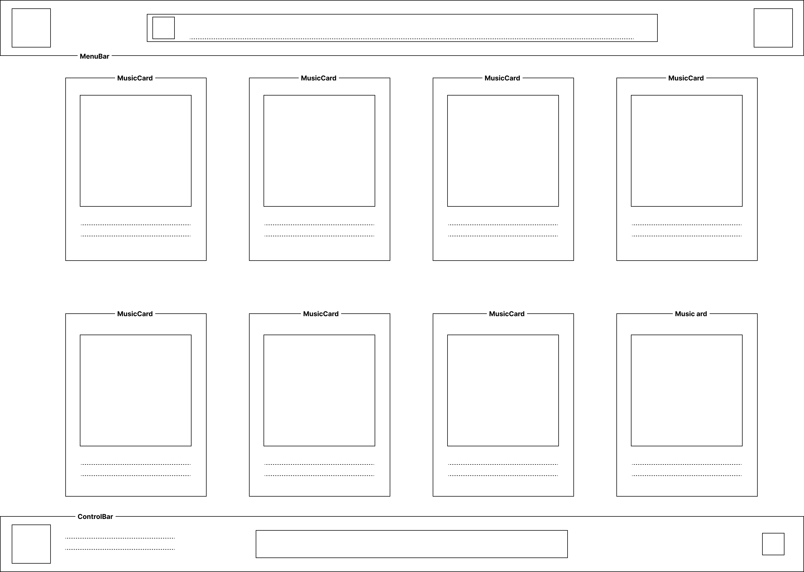
  
  **Fig. 1** : Maquette de la page d'accueil
  
- Une recherche de titre ou d'album redirigera vers un URI de type `/search?q=music+title`
  
  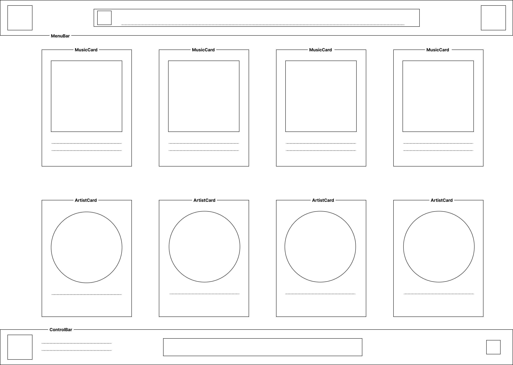
  
  **Fig. 2** : Maquette de la page des résultats d'une recherche
  
- Les albums et playlist sont des regroupement de musiques ils auront pour URI `/album?list={id}` et `/playlist?list={id}`
  
  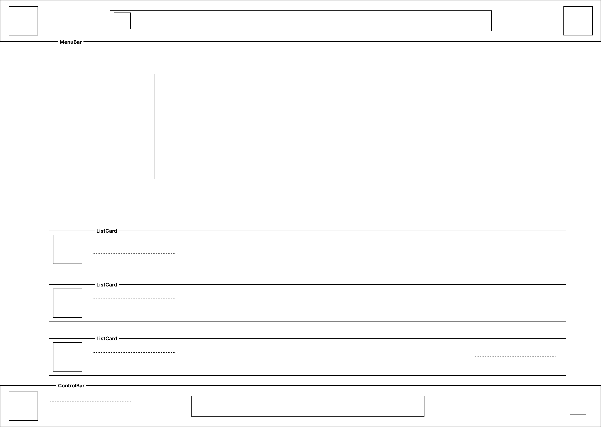
  
  **Fig. 3** : Maquette de la page d'une liste de titres
  
- Les musiques seront de type `/track?listen={id}`
  
  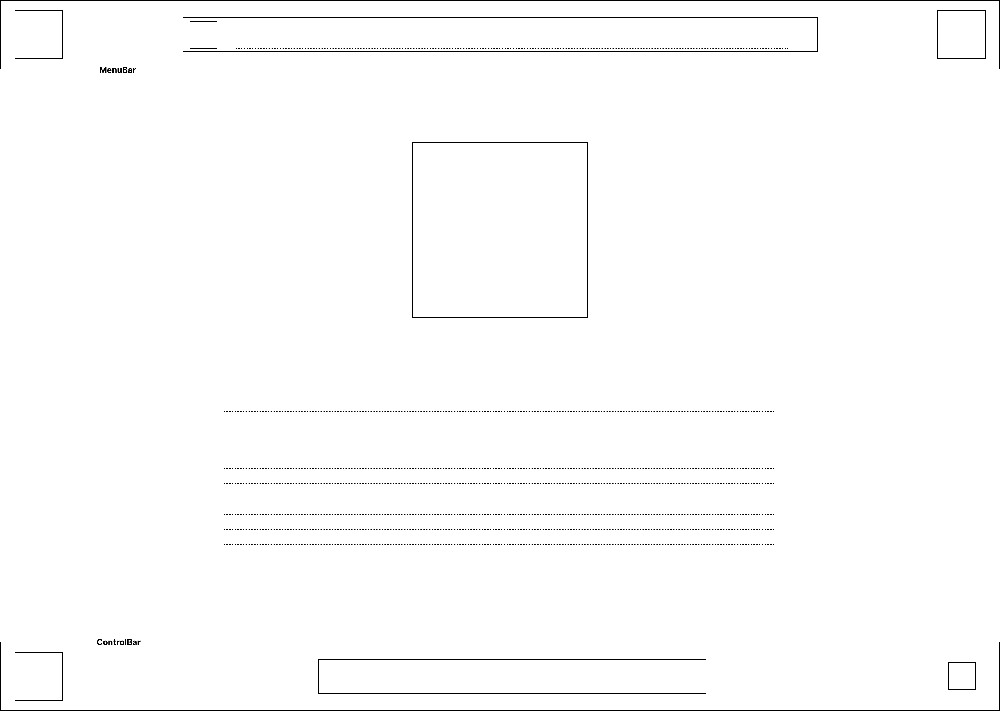
  
  **Fig. 4** : Maquette de la page d'un titres
  
- Les artistes seront de type `/artist?profil={id}`

Pour avoir un site rapide et compact nous allons limiter le nombre de titre disponible à une vingtaine. Cela permettra de ne pas héberger un trop lourd paquet de données.
De plus, pour ne pas violer les droits d'auteurs des différents label musicaux nous avons créer un échantillon de données à l'aide de dummy.json [générateur](./frontend/sample_data.hbs) => [résultat](./frontend/sample_data.json).

Le modèle de données comprend deux grand type d'item, les `music` et les `list` (album/playlist), ces item possèdent :

- `id`
- `title`
- `artist`
- `picture`
- etc...

## Prototype n°1 : Fonctionnalités pour le scénario prioritaire avec données chargées de manière statique
### Objectif
Cette première version du prototype a pour but de valider le scénario prioritaire :  
> « Lance des playlists/musiques depuis l'accueil »

Les données sont encore chargées de manière statique, et seules les fonctionnalités nécessaires à ce scénario ont été implémentées.

### Page d'acceuil

La page d'acceuil affiche des musiques aléatoires à partir d’un échantillon de données statiques, sous une forme proche de la maquette initiale.

Nous utilisons actuellement un framework CSS minimaliste : [PicoCSS](https://picocss.com/).  
Son empreinte est faible, ce qui en fait un bon candidat pour le prototype.  
Une évaluation ultérieure permettra de déterminer si l’adoption d’un framework plus complet (comme Bootstrap) est acceptable d’un point de vue environnemental.

### Choix de conception
- Choix d'image de basse résolutions pour les pochettes de musiques, bien que les photos sont demandantes en ressources, les pochettes d'album font parties de leur identité
- Tendre vers le minimaliste en affichant le moins de données possible 

### Évaluation de l’impact environnemental du frontend

Même si les données ne sont pas encore chargées dynamiquement, nous avons pu mesurer l’impact du rendu des données statiques et de la pile technique actuelle (React, PicoCSS, DayJS).

Les résultats montrent déjà un impact très faible, notamment grâce à la minification et à la concaténation automatique du code et des feuilles de style en mode pré-production.

| Mode | EcoIndex | Performance | Accessibilité | Bonnes pratiques | Taille du DOM | Requêtes | Taille de la page (ko)
|------|----------|-------------|---------------|------------------|---------------|----------|-----------------------|
| Développement | 79 B 🟠 | 58 | 91 | 96 | 130 | 31 | 3.1
| Pré-production | 91 A 🟢 | 100 | 91 | 96 | 123 | 6 | 0.7

**Tab.4** : Évaluation de l’impact du prototype de la page d’accueil

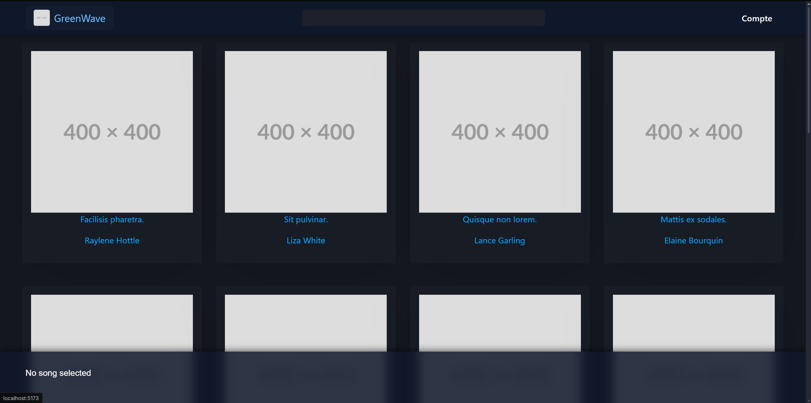

**Fig.5** : Prototype de la page d'une musique.

### Pages d'un titre de musique

Les pages des musiques ont pour HTTP-URI `/{id-music}`.
Nous implémentons maintenant la page des musiques, pour cela nous nous bason le plus fidèlement à notre maquette avec la pochette de la musique avec ses informations disposées succintement.

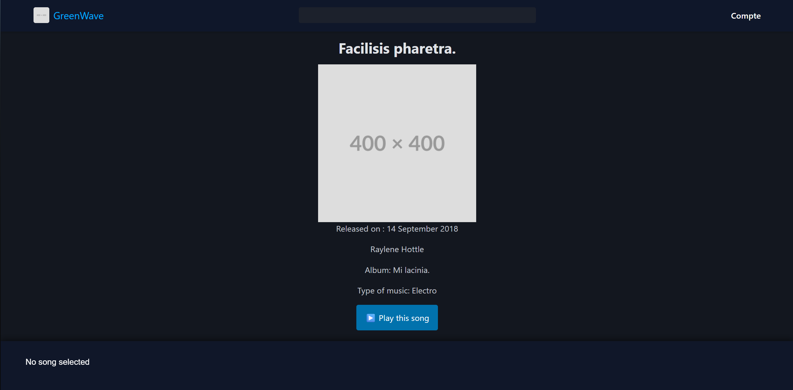
**Fig.6** : Prototype de la page d'une musique.

Une fois cette page ajoutée nous pouvons maintenant réaliser le scénario principal et donc mesuer son impact. Pour cela nous effectuons de nouveau le même protocole avec EcoIndex.

|   | EcoIndex| GES (gCO2e) | Taille du DOM | Requêtes | Taille de la page (ko)
|---|--------:|------------:|--------------:|---------:|---------------------:
| 1. Consulter les musique					                          | 91 A🟢 | 1,19 | 112 | 4 | 98
| 2. Choisir une musique et la charger 			                  | 96 A🟢 | 1,07 |  19 | 4 | 1
| 3. Revenir à la page d'acceuil et choisir une autre musique	| 91 A🟢 | 1,18 | 112 | 4 | 1
| 4. Lancer cette musique                                     | 96 A🟢 | 1,07 |  19 | 4 | 1

**Tab.5** : Évaluation de l'impact du scénario "Lance des playlists/musiques depuis l'accueil" dans le prototype n°1.

Ce premier prototype de GreenWave valide avec succès le scénario prioritaire ("lancer des playlists/musiques depuis l’accueil") tout en confirmant la faible empreinte environnementale de la solution.
Grâce à des choix techniques sobres — chargement statique des données, optimisation du code, et usage d’un framework léger (PicoCSS) —, le service atteint des scores EcoIndex entre 91 et 96 (classe A 🟢), indiquant un site très économe en ressources.

Ces résultats démontrent qu’il est possible de proposer une expérience fluide et esthétique tout en limitant drastiquement les émissions de CO₂ et le volume de données transférées.

## Prototype n°2 : Données statiques chargées de manière dynamique

Ce prototype charge maintenant les données de manière dynamiques, c'est à dire qu'elle sont chargées par le frontend par le réseau (accessible par HTTP). Cela ne change donc pas les fontionnalités mais se rapproche d'un mécanisme plus réel.

Quant a l'évolution de l'impact environnemental sur le scénario prioritaire déjà testé (cf Tab.2) aucun changement majeur est à noter. Seul le nombre de requête est augmenté de 2 ou 3 (sur une base de 4).

## Mesures de la consommation énergétique lors du passage à l'échelle

Avec un prototype fonctionnel, nous pouvons simuler un "passage à l'échelle" qui augmente drastiquement.

Nous pouvons imaginer que le nombre de musique et d'artiste stockés dans l'application viendra directement de sa popularité. Si des artistes connus ou en masse viennent sur l'application, les utilisteurs suivront et donc ne prendrons qu'un abonnement pour accéder à toutes leurs musiques préférées. Le reste des artistes devront aussi suivre et migrer vers notre application, faisant ainsi augmenter le nombre de données. C'est un cercle vertueux.

Prenons l'exemple d'un artiste très connu utilisant le service, l'arrivée de 500 artistes est probable, apportant chacun 5 musiques, pour arriver à une base de données de 2 000 musiques.
Nous multiplions donc par 100 la base de données de notre service.

### Évolution de l'EcoIndex lors du passage à l'échelle

Maintenant que nous avons ajouté à l'intégration continue l'analyse de l'impact environnemental de notre scénario principal. Nous pouvons récolter et consulter les mesures nécessaires à la production de l'EcoIndex, [avant](https://github.com/UTT-GL03/GreenWave/actions/runs/19234861546) et [après](https://github.com/UTT-GL03/GreenWave/actions/runs/19236074108).
Le passage à l'échelle montre bien l'augmentation du DOM de la page passant de 121 à 10 021 ainsi que le poid de la page passant de 365 Ko à 1 957 Ko à l'ouverture.

|   | EcoIndex| GES (gCO2e) | Taille du DOM | Requêtes | Taille de la page (ko)
|---|--------:|------------:|--------------:|---------:|---------------------:
| 1. Consulter les musiques			                    | <del>83 A 🟢</del> 35 E 🟠 | <del>1,34</del> 2,3  | <del>121</del> 10 021 | 8                   | <del>365</del> 1 957
| 2. Choisir une musique et la charger 	            | <del>91 A 🟢</del> 87 A 🟢 | <del>1,18</del> 1,26 | 28                        | 2                   | <del>14</del> 810
| 3. Revenir à la page et choisir une autre musique	| <del>87 A 🟢</del> 41 D 🟡 | <del>1,26</del> 2,18 | <del>134</del> 10 034 | <del>1</del> 26 | <del>5</del> 133
| 4. Lancer la musique                             	| <del>90 A 🟢</del> 86 A 🟢 | <del>1,2</del> 1,28  | 41                        | 2                   | <del>14</del> 810

**Tab.6** : Effet du passage à l'échelle sur l'impact du scénario "Lance des musiques depuis l'accueil".

### Mesure de la consommation énergétique liée à la consultation
Nous utilisons l'outil GreenFrame, qui permet de calculer et d'estimer la consommation energétique de notre service sur la base de plusieurs composants comme :
- le CPU (à partir du temps de calcul),
- la mémoire vive (à partir de la taille des données mémorisées),
- le disque (à partir de la taille des données lues et écrites),
- le réseau (à partir de la taille des données reçues et envoyées),
- et pour le navigateur uniquement, de l'écran (à partir du temps d'exécution du scénario).

 (a)                 | cpu (mWh)  | mem (mWh)  | disk (mWh) | network (mWh) | screen (mWh) | total (mWh)   |
| ------------------ | ---------- | ---------- | ---------- | ------------- | ------------ | ------------- | 
| Navigateur         | 110.0      | 0.79       | 0.0        | 7.9           | 280.0        | 400.0         |
| Serveur Web        | 0.017      | 0.054      | 0.0        | 6.5           | 0.0          | 6.6           |

 (b)                 | cpu (mWh)  | mem (mWh)  | disk (mWh) | network (mWh) | screen (mWh) | total (mWh)   |
| ------------------ | ---------- | ---------- | ---------- | ------------- | ------------ | ------------- | 
| Navigateur         | 1.2        | 0.055      | 0.0        | 7.8           | 68.0         | 77.0          |
| Serveur Web        | 0.020      | 0.013      | 0.0        | 6.5           | 0.0          | 6.5           |

**Tab.7** : Présente l’estimation de la consommation énergétique lors de la consultation de la page d’accueil (tableau a) et lors de la consultation d’une musique (tableau b).

Les résultats montrent que la consommation côté serveur web reste très faible par rapport à celle du navigateur. La majeure partie de l’énergie est donc consommée côté client, principalement pour l’affichage et l’interaction avec la page.

Au niveau du navigateur, les postes les plus énergivores sont :
- l’écran, qui reste actif durant toute la consultation ;
- le CPU, sollicité pour le rendu et l’exécution du code ;
- le réseau, utilisé pour le transfert des données entre le client et le serveur.

L’expression des résultats en milliwattheures (mWh) permet de mieux visualiser les ordres de grandeur : la consommation reste faible à l’échelle d’une seule consultation, mais elle est dominée par l’affichage et les échanges réseau.

En comparant la consultation de la page d’accueil et celle d’une musique spécifique, on constate que cette dernière consomme nettement moins d’énergie, notamment au niveau de l’écran et du CPU du navigateur. Cela s’explique par le fait que la page d’accueil affiche l’ensemble des musiques de la base de données et que le scénario de test fait défiler toute la page, ce qui prolonge significativement la durée d’exécution.

### Passage de données statique à une base de données dynamique et effets observés

Dans cette étape du projet, nous avons intégré CouchDB comme nouvelle base de données pour l’application. Après l’avoir découverte via Docker, créée et configurée manuellement, puis automatisée dans docker-compose et dans la chaîne d’intégration continue, nous avons demandé à GreenFrame de mesurer à nouveau l’impact environnemental du scénario principal. 

|                    | cpu (s)                                     | screen (s) | mem (B)                                   | disk (B) | network (B)                               |
| ------------------ | ------------------------------------------- | ---------- | ----------------------------------------- | -------- | ----------------------------------------- |
| Navigateur         | <del>0,0946</del> <add>0,195</add>      | 17,5       | <del>1,43e+8</del> <add>1,36e+8</add> | 0,00     | <del>1,52e+6</del> <add>1,72e+6</add> |
| Serveur Web        | <del>0,00114</del> <add>0,000230</add>  | 0,00       | <del>2,35e+7</del> <add>5,61e+6</add> | 0,00     | <del>1,27e+6</del> <add>3,69e+5</add> |
| Base de données    | <del>0</del> <add>0,130</add>           | 0,00       | <del>0</del> <add>1,02e+8</add>       | 0,00     | <del>0</del> <add>1,35e+6</add>       |

**Tab.8** : Présente l’évolution de l’utilisation des ressources suite à l’introduction de la base de données lors de la consultation d’une musique.

On observe l’apparition d’une consommation propre à la base de données, en particulier :
- du temps CPU,
- de la mémoire,
- et du trafic réseau.

En parallèle, certaines consommations côté serveur web diminuent, car une partie du travail est désormais déléguée à CouchDB. En revanche, la charge côté navigateur évolue peu, avec une légère augmentation du trafic réseau due aux échanges supplémentaires avec la base.

## Impacts énergétique après l'introduction de CouchDB

Nous avons à nouveau utilisé GreenFrame pour estimer la consommation énergétique à partir :
- du CPU,
- de la mémoire vive,
- du disque,
- du réseau,
- et de l’écran (pour le navigateur).

 (a)                 | cpu (mWh)              | mem (mWh)                 | disk (mWh) | network (mWh)          | screen (mWh) | total (mWh)            |
| ------------------ | ---------------------- | ------------------------- | ---------- | ---------------------- | ------------ | ---------------------- | 
| Navigateur         | 110,0                  | <del>0,79</del> 0,35  | 0,0        | <del>7,9</del> 17  | 280,0        | 400                    |
| Serveur Web        | 0,017                  | <del>0,054</del> 0,46 | 0,0        | <del>6,5</del> 1,9 | 0,0          | <del>6,6</del> 2,0 |
| Base de données    | <del>0,0</del> 6,2 | <del>0,0</del> 0,020  | 0,0        | <del>0,0</del> 14  | 0,0          | <del>0,0</del> 20  |

 (b)                 | cpu (mWh)                   | mem (mWh)                  | disk (mWh) | network (mWh)          | screen (mWh) | total (mWh)            |
| ------------------ | --------------------------- | -------------------------- | ---------- | ---------------------- | ------------ | ---------------------- | 
| Navigateur         | <del>1,2</del> 2,5      | <del>0,055</del> 0,057 | 0,0        | <del>7,8</del> 8,8 | 68,0         | <del>77,0</del> 80 |
| Serveur Web        | <del>0,020</del> 0,0079 | 0,013                      | 0,0        | <del>6,5</del> 1,9 | 0,0          | <del>6,5</del> 1,9 |
| Base de données    | <del>0,0</del> 2,3      | <del>0,0</del> 0,053   | 0,0        | <del>0,0</del> 6,9 | 0,0          | <del>0,0</del> 9,2 |

**Tab.9** : Présente l’estimation de la consommation énergétique lors de la consultation de la page d’accueil (tableau a) et lors de la consultation d’une musique (tableau b), après l’introduction de la base de données.

Les résultats confirment que la consommation reste majoritairement portée par le navigateur. L’écran demeure la principale source de consommation, suivi du CPU et du réseau.

L’introduction de la base de données ajoute une nouvelle source de consommation, non négligeable, en particulier au niveau du réseau et du CPU côté CouchDB. Malgré cela, l’ordre de grandeur reste dominé par la partie cliente.

Comme précédemment, la consultation d’une seule musique reste beaucoup moins coûteuse que l’affichage de la page listant toutes les musiques, en raison de la quantité d’informations affichées et de la durée du scénario.

## Comparaison avec EcoIndex avant et après CouchDB

Nous pouvons ainsi comparer les mesures obtenues avec EcoIndex [avant](https://github.com/UTT-GL03/GreenWave/actions/runs/19236074108) et [après](https://github.com/UTT-GL03/GreenWave/actions/runs/19541777899) ce changement.

|                                                   | EcoIndex                        | GES (gCO2e)              | Taille du DOM  | Requêtes | Taille de la page (ko)
|---------------------------------------------------|--------------------------------:|-------------------------:|---------------:|---------:|---------------------:
| 1. Consulter les musiques			                    | <del>35 E 🟠</del> 33 E 🟠 | <del>2,3</del> 2,34  | 10 021         | 8        | <del>1 957</del> 2 612
| 2. Choisir une musique et la charger 	            | <del>87 A 🟢</del> 85 A 🟢 | <del>1,26</del> 1,32 | 28             | 2        | <del>810</del> 1 137
| 3. Revenir à la page et choisir une autre musique	| <del>41 D 🟡</del> 40 D 🟡 | <del>2,18</del> 2,2  | 10 034         | 26       | <del>133</del> 137
| 4. Lancer la musique                             	| <del>86 A 🟢</del> 84 A 🟢 | <del>1,28</del> 1,32 | 41             | 2        | <del>810</del> 1 137

**Tab.10** : Effet du passage de la base de données (CouchDB) mesuré avec EcoIndex.

Ce que nous observons, c’est que le passage à CouchDB n’a pas entraîné une amélioration de l’empreinte environnementale, mais plutôt un léger recul pour certaines étapes. Globalement, les notes EcoIndex restent proches, mais les pages deviennent plus lourdes et certaines actions consomment davantage de ressources.

Ce passage à CouchDB était une étape nécessaire pour rendre l’application plus réaliste et mieux structurée. Les résultats montrent cependant qu’il faudra désormais travailler sur l’optimisation : réduire le nombre d’appels inutiles, limiter les volumes de données transmis, et alléger l’interface afin d’améliorer l’EcoIndex global.

Cela prouve donc que EcoIndex ne se base pas sur des facteurs assez précis, puisque via Greenframe nous avons une économie d'énergie qu'EcoIndex ne voit pas.

## Stratégie de limitation du nombre de musiques affichées
Dans une médiathèque musicale classique (CD, vinyles, playlists physiques…), les nouveautés disponibles sont limitées aux titres récemment ajoutés ou publiés.

Toutefois, cette logique ne peut pas être appliquée directement dans une application numérique, car les musiques y sont souvent rendues accessibles dès qu’elles sont ajoutées dans la base de données, parfois à des rythmes irréguliers.

Dès lors, deux stratégies équivalentes peuvent être envisagées pour afficher sur la page d’accueil une sélection cohérente de titres récents :

- Afficher uniquement les musiques ajoutées aujourd’hui, ainsi que celles déjà préparées pour les ajouts du lendemain.
- Afficher les n dernières musiques ajoutées, où n correspondrait au volume habituel de titres mis en avant (par exemple 20).

Dans les deux cas, ce filtrage nécessite d’indexer ou de stocker les musiques en fonction de leur date et heure d’ajout dans la base.

Nous retiendrons la seconde stratégie, car elle garantit une expérience utilisateur plus homogène : peu importe le moment de la journée où l’utilisateur ouvre l’application, il verra toujours les titres les plus récemment publiés, sans variation de quantité ou de pertinence.

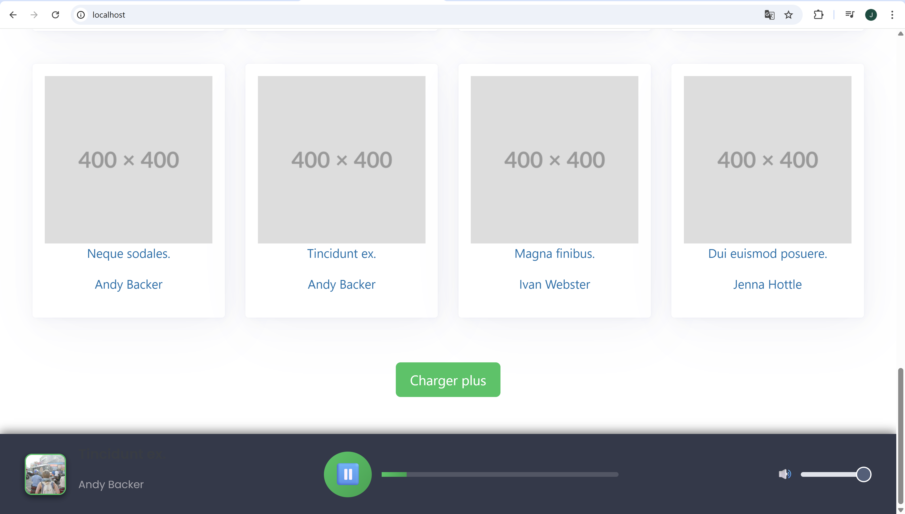
 **Fig. 5** : Chargement progressif (à la demande) des musiques (copie d'écran).
 (a)                 | cpu (mWh)                   | mem (mWh)                  | disk (mWh) | network (mWh)          | screen (mWh)            | total (mWh)            |
| ------------------ | --------------------------- | -------------------------- | ---------- | ---------------------- | ----------------------- | ---------------------- | 
| Navigateur         | <del>110,0</del> 3,7    | <del>0,35</del> 0,053  | 0,0        | <del>17</del> 2,0  | <del>280,0</del> 69 | <del>400</del> 75  |
| Serveur Web        | <del>0,017</del> 0,0046 | <del>0,46</del> 0,0030 | 0,0        | <del>1,9</del> 1,9 | 0,0                     | <del>2,0</del> 1,9 |
| Base de données    | <del>6,2</del> 0,87     | <del>0,020</del> 0,052 | 0,0        | <del>14</del> 0,14 | 0,0                     | <del>20</del> 1,1  |

**Tab.11** : Effet sur la consommation énergétique du chargement progressif (à la demande) lors de la consultation des musiques de la plateforme de streaming.

L’implémentation de la stratégie en question (cf. Fig.5) a l’effet attendu (cf. Tab.11) : la consommation électrique de l’ensemble des composants se retrouve fortement réduite, jusqu’à devenir majoritairement dominée par celle de l’écran.

On pourrait bien sûr objecter que, si l’on souhaitait afficher l’intégralité du catalogue musical, la consommation deviendrait alors supérieure à celle observée avant la mise en place du chargement progressif. Toutefois, le nombre important d’interactions nécessaires pour parvenir à un tel résultat rend ce scénario d’usage peu probable, d’autant plus que les morceaux les plus récents sont affichés en priorité.

Pour résumer, le passage d’un affichage exhaustif de l’ensemble des musiques à un chargement progressif par tranches a permis de réduire la consommation globale du navigateur de **400 mWh à 75 mWh**, et celle de la base de données de **20 mWh à 1,1 mWh**. Des techniques simples de base de données (indexation par date d’ajout, limitation du nombre de résultats et pagination) ont permis de ramener la consommation énergétique à un niveau proche de sa valeur minimale.

En l’état, la consommation électrique devient quasi constante vis-à-vis de la volumétrie totale du catalogue musical, et atteint un niveau si faible que la part liée au CPU, à la mémoire et au réseau devient négligeable face à celle de l’écran.

L’enjeu des évolutions futures de la plateforme sera donc de veiller au maintien de cette sobriété.

## Améliorations et évolutions du service
Après la première version fonctionnelle du service, une phase d’amélioration a été engagée avec un objectif clair : améliorer la qualité d’usage sans augmenter significativement l’impact écologique.
Pour cela, nous avons repris certaines fonctionnalités identifiées mais laissées en attente, et avons procédé à leur développement de manière itérative, en mesurant systématiquement leur impact.

### Fonctionnalité ajoutée : Recherche par nom de musique
L’une des grandes améliorations apportées est l’ajout de la recherche d’un titre par son nom, fonctionnalité que l’on trouve sur toutes les plateformes musicales modernes. Elle répond à un besoin essentiel : permettre à l’utilisateur de retrouver rapidement un morceau précis, sans devoir parcourir manuellement albums ou playlists.

La recherche est prioritaire pour nous puisqu'elle représente l’un des usages les plus courants d'un service de streaming, elle améliore fortement l’ergonomie générale et réduit le nombre de pages à charger, elle rend le service utilisable même en présence d’un catalogue plus grand et elle s’inscrit pleinement dans une démarche d’écoconception, car elle évite des actions inutiles (navigation, rechargement de listes complètes…).

Notre recherche peut encore être améliorée puisqu'actuellement elle fonctionne seulement avec le premier mot du titre de la musique et ne décompose pas les différents mots du titre pour rechercher dedans.

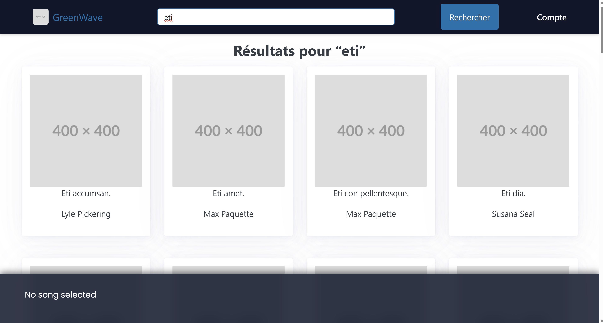
 **Fig. 6** : Fonctionnalité de recherche (copie d'écran).

#### Analyse des impacts
Un des enjeux de cette phase d'amélioration était de vérifier que la recherche n'introduise pas un surcoût environnemental.
Nous avons donc mesuré l’impact de trois scénarios GreenFrame (consultation accueil, consultation musique, recherche).

 (a)                 | cpu (mWh) | mem (mWh) | disk (mWh) | network (mWh) | screen (mWh) | total (mWh) |
| ------------------ | --------- | --------- | ---------- | ------------- | ------------ | ----------- | 
| Navigateur         | 3,4       | 0,054     | 0,0        | 2,0           | 70           | 75          |
| Serveur Web        | 0,0035    | 0,0029    | 0,0        | 1,9           | 0,0          | 1,9         |
| Base de données    | 0,78      | 0,058     | 0,0        | 0,14          | 0,0          | 0,97        |

 (b)                 | cpu (mWh) | mem (mWh) | disk (mWh) | network (mWh) | screen (mWh) | total (mWh) |
| ------------------ | --------- | --------- | ---------- | ------------- | ------------ | ----------- | 
| Navigateur         | 1,3       | 0,048     | 0,0        | 2,1           | 68,0         | 71          |
| Serveur Web        | 0,0032    | 0,0028    | 0,0        | 1,9           | 0,0          | 1,9         |
| Base de données    | 0,68      | 0,056     | 0,0        | 0,16          | 0,0          | 9,0         |

 (c)                 | cpu (mWh) | mem (mWh) | disk (mWh) | network (mWh) | screen (mWh) | total (mWh) |
| ------------------ | --------- | --------- | ---------- | ------------- | ------------ | ----------- | 
| Navigateur         | 1,2       | 0,0028    | 0,0        | 1,4           | 1,0          | 3,6         |
| Serveur Web        | 0,0023    | 1,0e-4    | 0,0        | 1,3           | 0,0          | 1,3         |
| Base de données    | 0,10      | 0,0021    | 0,0        | 0,093         | 0,0          | 0,20        |

**Tab.12** : Présente l’estimation de la consommation énergétique lors de la consultation de la page d’accueil (tableau a) et lors de la consultation d’une musique (tableau b), lors de la recherche (tableau c) après l’introduction de la fonctionnalité de recherche avec GreenFrame.

Les mesures avec GreenFrame montrent que la recherche est de loin l’action la plus sobre de notre service avec seulement ~5 mWh, elle consomme environ 20 fois moins que la consultation de l’accueil ou d’un titre.
Elle n’introduit donc aucun surcoût significatif tout en apportant un gain majeur d’usage, puisqu’elle évite la navigation et le chargement de pages plus lourdes.

Pour compléter cette analyse avec une approche orientée interface, nous avons également évalué l’impact de la nouvelle fonctionnalité à l’aide de GreenIT-Analysis, en observant les variations d’EcoIndex, de taille du DOM et du nombre de requêtes sur nos scénarios d’usage.

| (a)                                               | EcoIndex | GES (gCO2e) | Taille du DOM  | Requêtes | Taille de la page (ko) |
|---------------------------------------------------|---------:|------------:|---------------:|---------:|------------------------:
| 1. Consulter les musiques			                    | 83 A 🟢 | 1,34        | 123            | 12       | 361                    |
| 2. Choisir une musique et la charger 	            | 91 A 🟢 | 1,19        | 35             | 4        | 8                      |
| 3. Revenir à la page et choisir une autre musique	| 88 A 🟢 | 1,24        | 89             | 3        | 6                      |
| 4. Lancer la musique                             	| 90 A 🟢 | 1,2         | 42             | 4        | 7                      |

| (b)                                               | EcoIndex | GES (gCO2e) | Taille du DOM  | Requêtes | Taille de la page (ko) |
|---------------------------------------------------|---------:|------------:|---------------:|---------:|------------------------:
| 1. Chargement de la page d'accueil                | 83 A 🟢 | 1,34        | 123            | 12       | 361                    |
| 2. Effectuer une recherche           	            | 84 A 🟢 | 1,31        | 123            | 28       | 372                    |
| 3. Choisir une musique                          	| 91 A 🟢 | 1,18        | 29             | 4        | 7                      |
| 4. Lancer la musique                             	| 90 A 🟢 | 1,2         | 42             | 5        | 8                      |
| 5. Revenir à la page d'accueil                   	| 88 A 🟢 | 1,24        | 136            | 0        | 0                      |
| 6. Effectuer une nouvelle recherche             	| 87 A 🟢 | 1,36        | 136            | 1        | 5                      |
| 7. Choisir une musique                          	| 90 A 🟢 | 1,2         | 42             | 4        | 7                      |
| 8. Lancer la musique                             	| 90 A 🟢 | 1,2         | 42             | 4        | 7                      |

**Tab.13** : Présente l’estimation de la consommation énergétique lors du scénario 1 (tableau a) et lors du scénario 2 (tableau b) avec EcoIndex.

Les résultats montrent que l’ajout de la recherche ne dégrade pas la performance environnementale des pages, puisque l’EcoIndex reste systématiquement en classe A, avec des émissions similaires à celles du scénario initial. Les variations observées (légère hausse du nombre de requêtes lors de la recherche) sont compensées par un DOM stable et une taille de page maîtrisée, confirmant que la fonctionnalité reste sobre et bien intégrée.

En combinant les mesures GreenFrame et GreenIT, nous confirmons que la recherche apporte un bénéfice d’usage majeur tout en maintenant un impact écologique très faible. Elle s’intègre donc naturellement dans notre démarche d’écoconception et justifie pleinement sa place dans la version finale du service.

### Fonctionnalité ajoutée : Favoris (ajout d’une musique + onglet Favoris)
Une amélioration importante apportée au service est l’ajout d’un système de favoris, permettant à l’utilisateur d’enregistrer rapidement des musiques qu’il aime et de les retrouver dans un onglet dédié “Favoris”. Cette fonctionnalité répond à un besoin courant sur les plateformes musicales : éviter de “rechercher à nouveau” un titre ou de parcourir le catalogue pour le retrouver.

L’ajout aux favoris est un geste simple avec un bouton “Ajouter aux favoris”), disponible directement sur la fiche musique. L’onglet Favoris répertorie ensuite l’ensemble des titres marqués, et permet de lancer la lecture en un minimum d’actions.

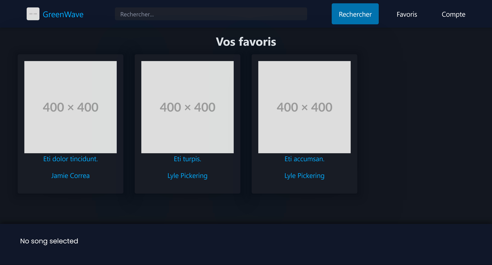 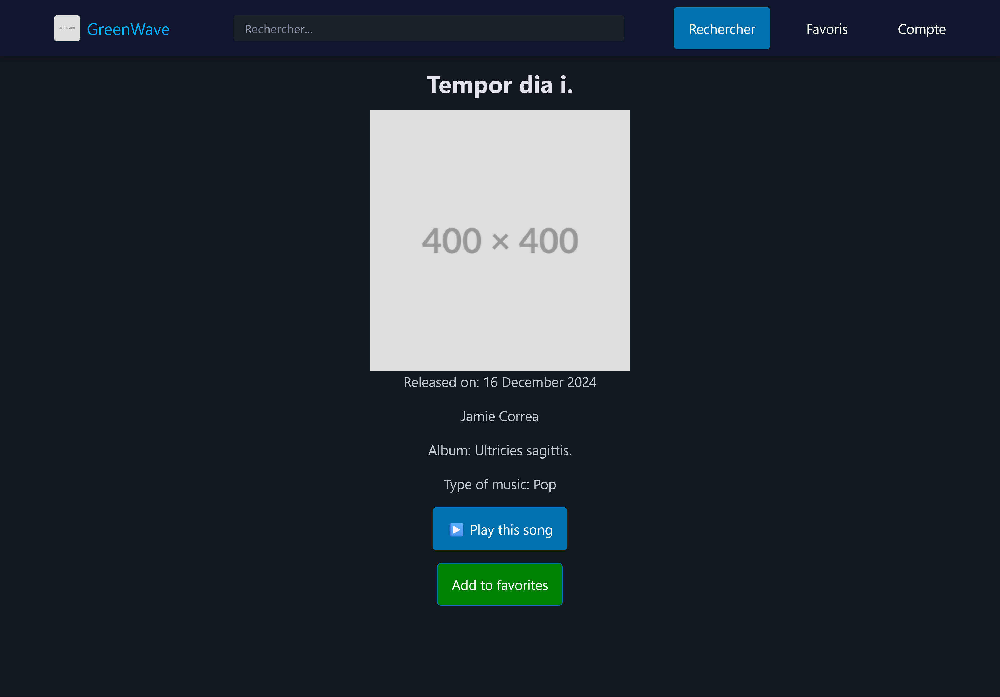 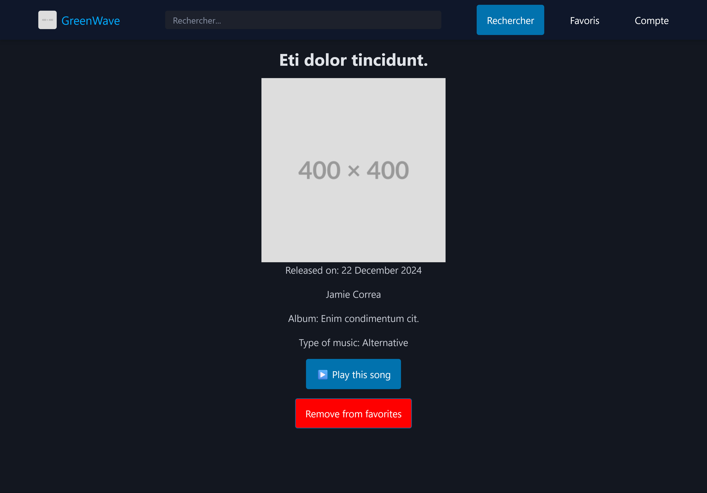
 **Fig. 6** : Fonctionnalité de favoris (copies d'écran).

#### Analyse des impacts
L’ajout de la fonctionnalité de favoris a nécessité l’introduction de nouvelles interactions, notamment l’enregistrement d’une musique et l’affichage d’un onglet dédié. Afin d’évaluer l’impact de ces nouvelles actions, une analyse énergétique a été réalisée à l’aide de GreenFrame.

 (a)                 | cpu (mWh) | mem (mWh) | disk (mWh) | network (mWh) | screen (mWh) | total (mWh) |
| ------------------ | --------- | --------- | ---------- | ------------- | ------------ | ----------- | 
| Navigateur         | 3,5       | 0,053     | 0,0        | 2,1           | 69           | 75          |
| Serveur Web        | 0,0044    | 0,0029    | 0,0        | 1,9           | 0,0          | 1,9         |
| Base de données    | 0,70      | 0,070     | 0,0        | 0,14          | 0,0          | 0,92        |

 (b)                 | cpu (mWh) | mem (mWh) | disk (mWh) | network (mWh) | screen (mWh) | total (mWh) |
| ------------------ | --------- | --------- | ---------- | ------------- | ------------ | ----------- | 
| Navigateur         | 1,4       | 0,048     | 0,0        | 2,1           | 67,0         | 71          |
| Serveur Web        | 0,0041    | 0,0029    | 0,0        | 1,9           | 0,0          | 1,9         |
| Base de données    | 0,77      | 0,067     | 0,0        | 0,17          | 0,0          | 1,0         |

 (c)                 | cpu (mWh) | mem (mWh) | disk (mWh) | network (mWh) | screen (mWh) | total (mWh) |
| ------------------ | --------- | --------- | ---------- | ------------- | ------------ | ----------- | 
| Navigateur         | 1,4       | 0,0045    | 0,0        | 2,0           | 1,5          | 4,9         |
| Serveur Web        | 0,0038    | 2,1e-4    | 0,0        | 2,0           | 0,0          | 2,0         |
| Base de données    | 0,12      | 0,0050    | 0,0        | 0,093         | 0,0          | 0,22        |

**Tab.14** : Présente l’estimation de la consommation énergétique lors de la consultation de la page d’accueil (tableau a) et lors de la consultation d’une musique (tableau b), lors de l'ajout en favoris (tableau c) après l’introduction de la fonctionnalité de favoris avec GreenFrame.

Les résultats présentés dans le tableau 14 montrent que la consultation d’une musique (tableaux a et b) reste comparable aux mesures réalisées avant l’ajout de la fonctionnalité de favoris. L’action d’ajout en favoris (tableau c) présente une consommation énergétique plus faible, en raison d’une interaction courte et d’un affichage limité.

La majorité de la consommation est liée au poste screen côté navigateur pour les scénarios de consultation, tandis que l’ajout en favoris sollicite principalement le serveur web et la base de données via une opération d’écriture simple, sans accès disque significatif.

Pour compléter cette analyse avec une approche orientée interface, nous avons également évalué l’impact de la nouvelle fonctionnalité à l’aide de GreenIT-Analysis, en observant les variations d’EcoIndex, de taille du DOM et du nombre de requêtes sur nos scénarios d’usage.

| (a)                                               | EcoIndex | GES (gCO2e) | Taille du DOM  | Requêtes | Taille de la page (ko) |
|---------------------------------------------------|---------:|------------:|---------------:|---------:|------------------------:
| 1. Consulter les musiques			                    | 83 A 🟢 | 1,34        | 123            | 12       | 361                    |
| 2. Choisir une musique et la charger 	            | 91 A 🟢 | 1,19        | 35             | 4        | 8                      |
| 3. Revenir à la page et choisir une autre musique	| 88 A 🟢 | 1,24        | 89             | 3        | 6                      |
| 4. Lancer la musique                             	| 90 A 🟢 | 1,2         | 42             | 4        | 7                      |

| (b)                                               | EcoIndex | GES (gCO2e) | Taille du DOM  | Requêtes | Taille de la page (ko) |
|---------------------------------------------------|---------:|------------:|---------------:|---------:|------------------------:
| 1. Chargement de la page d'accueil                | 83 A 🟢 | 1,34        | 124            | 11       | 364                    |
| 2. Choisir une musique                          	| 90 A 🟢 | 1,2         | 31             | 5        | 8                      |
| 3. Ajouter la musique aux favoris               	| 90 A 🟢 | 1,2         | 31             | 7        | 8                      |
| 4. Aller sur la page Favoris                     	| 91 A 🟢 | 1,18        | 29             | 5        | 7                      |

**Tab.15** : Présente l’estimation de la consommation énergétique lors du scénario 1 (tableau a) et lors de l'ajout aux favoris (tableau b) avec EcoIndex.

Les résultats présentés dans le tableau 15 montrent que l’introduction de la fonctionnalité de favoris n’entraîne pas de dégradation notable des indicateurs. Les différents scénarios conservent un EcoIndex classé A, avec des valeurs proches entre la navigation classique et l’ajout aux favoris.

L’augmentation du nombre de requêtes observée lors de l’ajout aux favoris reste limitée et n’a pas d’impact significatif sur la taille du DOM ni sur la taille des pages chargées. L’accès à l’onglet Favoris présente des métriques similaires, voire légèrement inférieures, à celles observées lors des parcours de consultation classiques.

Cette analyse montre que la fonctionnalité de favoris s’intègre de manière cohérente dans l’application, en apportant une amélioration fonctionnelle sans introduire de surcoût énergétique significatif par rapport aux scénarios existants.

# Conclusion & perspectives
Ce projet avait pour objectif de concevoir et d’évaluer un service de streaming musical en intégrant dès sa conception les principes de sobriété numérique. Les différentes analyses menées à l’aide d’EcoIndex, GreenIT Analysis et GreenFrame nous a permis d’identifier plusieurs points clés.

Un premier constat concerne les plateformes de streaming musical dominantes. Les mesures réalisées montrent que des services largement utilisés comme Spotify ou Apple Music obtiennent des scores EcoIndex relativement faibles. Cela ne traduit pas un manque d’optimisation technique, mais plutôt des priorités de conception orientées vers la richesse fonctionnelle, la personnalisation et la captation de l’attention. Le chargement massif de contenus, la haute résolution systématique des visuels ou encore les requêtes déclenchées automatiquement illustrent des choix efficaces du point de vue marketing, mais peu compatibles avec des objectifs de sobriété environnementale. À l’inverse, nos résultats montrent qu’il est possible de proposer une expérience fluide tout en limitant fortement les ressources consommées.

Le second point porte sur la conception des fonctionnalités. Ce projet démontre qu’il n’est pas nécessaire de renoncer aux fonctionnalités pour réduire l’impact environnemental. Des fonctionnalités sobres, ciblées et bien implémentées peuvent au contraire améliorer l’expérience utilisateur sans surcoût énergétique significatif. La recherche musicale en est un exemple marquant : elle permet d’accéder rapidement à un contenu précis et évite la navigation dans des pages lourdes. Les mesures GreenFrame montrent qu’il s’agit de l’une des actions les plus sobres du service.

L’importance du réseau apparaît également comme un point central. La réduction du nombre de requêtes et de la quantité de données échangées s’avère déterminante pour limiter la consommation énergétique. L’usage du cache, tant côté client que côté serveur, permet d’éviter les téléchargements inutiles et de maintenir un impact faible, même lors du passage à l’échelle. Dans cette continuité, la mise en cache locale des musiques les plus écoutées constitue une piste d’amélioration prometteuse, en particulier pour limiter l’impact des écoutes répétées, très fréquentes dans les usages du streaming musical.

Enfin, les mesures montrent que la consommation énergétique est largement dominée par le navigateur et, plus précisément, par l’écran. Cette consommation ne peut pas être réduite uniquement par des optimisations techniques, mais elle peut être limitée par des choix de conception visant à éviter un « temps d’écran » excessif : absence de défilement infini, chargement non automatique des contenus et limitation des incitations à une consultation prolongée. L’objectif n’est pas de restreindre l’usage, mais de favoriser une utilisation raisonnée et adaptée au besoin.

En conclusion, ce projet montre qu’une démarche d’écoconception appliquée au streaming musical est compatible avec des technologies modernes et des usages réels. En combinant sobriété fonctionnelle, optimisation du réseau, usage intelligent du cache et attention portée aux comportements des utilisateurs, il est possible de concevoir un service performant, agréable et à faible impact environnemental.
